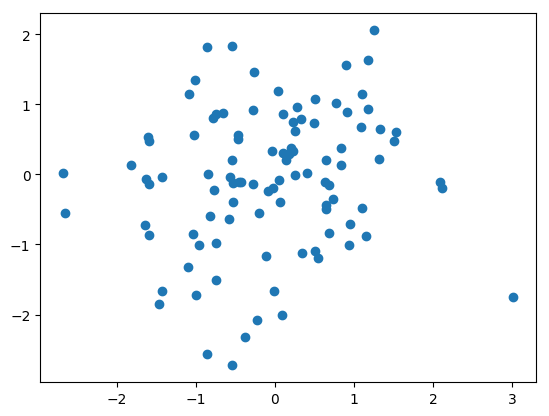

# Installing Dependencies

As with Python and R, Julia has a robust community of packages that are necessary to be successful with the language. The Julia distribution includes _only_ the Base package (more on this later), so any packages that you need to use will need to be installed on your machine. This section covers the setup on how to install these packages.

## Packages You Will Need

Below is an (incomplete) list of the packages you will need to have installed to following along with this book:

DataFrames, CategoricalArrays, Missings, LinearAlgebra, Statistics, Pandas, ScikitLearn, PyPlot, Seaborn, ...

## Installing Packages

To install packages, you first need to import the `Pkg` package which is included in the Julia distribution. The syntax for installing a package is:

```julia
import Pkg; Pkg.add("PkgName")
```

The purpose of the semicolon is to allow this to be executed on a single line and to suppress output from the import statement. If you need to install more than one package at once, you can also pass a vector of strings to `Pkg.add` and it will install each package listed:

```julia
import Pkg; Pkg.add(["Pkg1", "Pkg2", "Pkg3", ...])
```

## Importing Packages

When you need to use a package, you need to import it; that is, you need to add each object defined in the package to your environment. In Julia, there are two ways to import packages, one which requires appending the package name before each object and one which does not.

If you are unconcerned about object name overlaps, you can import packages with the `using` command. This brings all objects in a package to your environment.


{:.input_area}
```julia
using Statistics
```


Now, I can use functions from Statistics.jl to perform operations in my environment.


{:.input_area}
```julia
mean([1, 2, 3])
```


{:.output .output_data_text}
```
2.0
```


If you want to make sure that there is no overlap between your own functions (or the Base package) and the package you are importing, you can import using an `import` statement:


{:.input_area}
```julia
import Pandas
```


If you do this, you will need to call functions by appending the package name to the beginning and accessing with dot syntax, e.g. `Pandas.read_csv`.

### Aliasing Imports

In many cases, you want to avoid overlaps but don't want to have to type out the package name each time you want to use a function. In a language like Python, this is when you would use

```python
import package as pkg
```

Unfortunately, Julia does not currently provide a syntactic structure for aliasing imports. However, you can get around this using the `import` statement and then assignment a variable that references the package you've imported:


{:.input_area}
```julia
import PyPlot
plt = PyPlot
```


{:.output .output_data_text}
```
PyPlot
```


Now, I can use `plt` to reference functions from PyPlot.jl:


{:.input_area}
```julia
x = randn(100)
y = randn(100)
plt.scatter(x, y);
```


{:.output .output_png}



If you have trouble installing packages, see the [Julia documentation for packages](https://docs.julialang.org/en/v0.6.3/manual/packages/).
